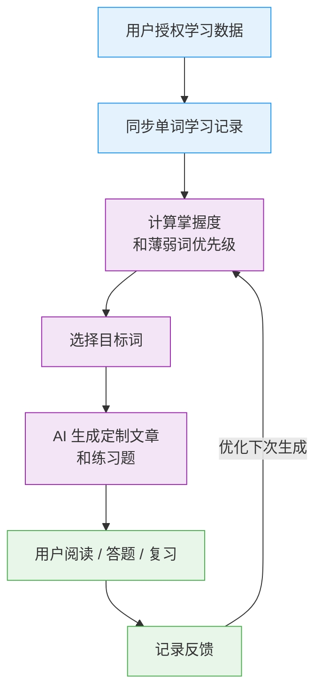

# 01 · 产品定位与范围

[← 文档导航](README.md) · [下一篇：技术栈与架构 →](02-architecture.md)

---

## 项目概述

本项目是一个面向英语词汇学习者的全栈 Web 应用。用户可以接入自己的词汇学习数据，例如通过墨墨背单词开放 API 同步学习记录，系统根据单词学习状态计算薄弱词优先级，再调用 AI 生成定制英文文章、阅读理解题、填空题和复习计划。

项目目标不是复刻墨墨背单词、不背单词或其他背词 App，而是做一个独立的 AI 语境学习层：把用户已经在背词软件里积累的学习记录转化为可阅读、可练习、可复盘的内容。

核心闭环：



## 产品命名与品牌边界

建议使用独立产品名，避免使用"墨墨""不背单词"等第三方品牌作为主品牌名。

可选暂定名：

- LexiForge
- VocabCraft
- WordContext
- ContextVocab

对外表述建议：

```text
一个第三方 AI 英语阅读与复习工具，可接入用户授权的学习数据来生成个性化练习内容。
```

避免使用：

```text
墨墨增强版
墨墨 Pro
墨墨 AI 版
官方替代品
```

## 目标用户

### 初期用户

- 正在使用墨墨背单词的英语学习者
- 希望通过语境记忆单词的大学生
- 备考四六级、考研、雅思、托福、GRE 的学生
- 想把薄弱词放进阅读材料里反复见到的用户

### 用户痛点

- 背词 App 能记录"认识/模糊/忘记"，但缺少个性化语境训练
- 只看单词卡片容易遗忘，缺少上下文
- 不知道哪些词最该优先复习
- AI 可以写文章，但手动整理薄弱词太麻烦
- 通用英语文章很难覆盖自己的薄弱词

### 核心价值

- 自动识别用户的薄弱词
- 用薄弱词生成连贯文章，而不是孤立例句
- 按难度、主题、考试方向生成内容
- 提供阅读理解、填空、复述等练习
- 沉淀学习报告和复习历史

### 为什么做独立 Web 产品而不只是 Claude Code Skill

本仓库已经存在一个 `memo-skills`（Claude Code Skill），可以在 CLI 里查询墨墨开放 API。本 Web 产品要解决 Skill 解决不了的问题：

- 不需要安装 Claude Code 或开通 Claude 订阅，浏览器即可使用
- 多设备访问（手机、平板、PC），通勤路上也能阅读生成的文章
- 沉淀学习历史、错题、复习记录，Skill 是一次性查询不持久化
- 自动定时同步 + 推送，不需要每次手动触发
- 面向不会用 CLI 的英语学习者（大学生群体）
- 把 AI 生成、覆盖率检测、二次修正封装成一键操作，用户不用写 prompt

Skill 是探索期工具，本产品是把同一份 API 知识做成给非技术用户的产品形态。

## 产品范围

### MVP 范围（约 4 周）

第一版只做最小可用闭环，**不开放注册登录**：

- Token 通过环境变量 `MAIMEMO_TOKEN` 配置，单用户使用
- 数据库 seed 一个 `local-user`（固定 UUID），所有外键正常指向，方便 v0.5 平滑扩展为多用户
- Go 后端拉取墨墨学习记录并写入 PostgreSQL
- 计算 mastery_score 与 weak_score（带 `score_version` / `score_reasons`，便于解释和重算）
- 前端展示总单词数、薄弱词列表
- 用户选择主题、难度、目标词数量
- AI 生成一篇英文文章
- 检查目标词覆盖率（让 AI 直接返回结构化 form + context，后端定位）
- 保存文章到 PostgreSQL，文章详情页稳定高亮目标词
- 文章历史列表 + 删除
- 支持导出 Markdown
- Docker Compose 一键启动 + README + 在线 Demo

MVP 阶段**明确不做**：注册登录、Token 加密存储、练习题（阅读理解/填空）、限流、定时同步任务、错题记录、CSV/Anki 导入。这些都在 v0.5 / v1。

### v0.5 范围（多用户与生产化基础）

MVP 稳定上线后引入：

- 用户注册登录（已有 `users` 表，从 1 行变多行）
- AES-GCM 加密存储 Token，支持多用户各自配置
- 接口限流
- 异步同步 + 任务状态管理（`sync_jobs`）
- 错误码体系与日志脱敏
- AES-GCM 存储格式、key 轮换、CSRF、CORS allowlist 等生产硬化（详见 [07-security.md](07-security.md)）
- **CSV / Excel / Anki .apkg 词表导入**（**战略级** — 见下方说明）

#### 为什么 CSV/Anki 导入是 v0.5 而不是 v1

墨墨开放 API **官方标注为实验性**，随时可能停用。如果墨墨同步是产品唯一数据入口，API 一断当天就没新用户进来。

CSV 导入是最便宜的去依赖手段：

- 用户从墨墨/欧路/不背单词导出 CSV → 手动上传 → 拿到完全相同的体验
- Anki 用户群比墨墨大，`.apkg` 导入直接打开新市场
- 实施成本低（CSV 解析 1-2 天，Anki 解析 2-3 天）
- 一旦上线，"墨墨 API 风险"从致命降级为不便

把 CSV 导入提级到 v0.5 是为了让产品有第二条腿，而不是只靠墨墨这一条。

### v1 范围

- 阅读理解题
- 填空题
- 错题记录
- 每日推荐
- 学习报告

### 后续商业化范围

- 多模型选择
- 更多 AI 文章额度
- 长文生成
- 考试专项模式
- 多设备同步
- 周报/月报
- 邮件提醒
- 会员支付
- 团队/班级版本

## 合规与数据边界

### 数据来源

初期只使用墨墨开放 API，并要求用户主动提供 Token 或完成授权。

当前已验证的墨墨学习记录字段包括：

```text
voc_id
voc_spelling
add_date
first_study_date
last_study_date
next_study_date
last_response
study_count
tags
```

其中：

```text
last_response: FAMILIAR / VAGUE / FORGET / WELL_FAMILIAR
tags: STICKING 等
```

当前按个人账号中 1000+ 条学习记录的数据规模设计；具体数量和分布会随上游账号状态变化，不作为产品契约。已验证的状态分布类型包括：

```text
最近反馈：
- FAMILIAR
- FORGET
- VAGUE
- WELL_FAMILIAR
标签：
- STICKING
```

### 用户授权

用户需要明确知道：

- 本产品是第三方工具
- 用户需要主动提供墨墨开放 API Token
- Token 只用于同步学习记录
- 用户可以删除 Token 和同步数据
- 用户数据可能会被发送给 AI 服务商用于生成文章

### AI 数据最小化

调用 AI 时只发送必要字段：

```text
word
last_response
study_count
tags
target_difficulty
topic
```

不发送：

```text
MAIMEMO_TOKEN
用户密码
手机号
邮箱
完整原始日志
第三方 Authorization Header
```

### 商业化边界

可以收费的是本产品自己的能力：

- AI 文章生成
- 个性化练习
- 学习分析
- 历史管理
- 导出
- 多模型能力

不要把收费点包装成"售卖墨墨数据访问权限"。

---

[← 文档导航](README.md) · [下一篇：技术栈与架构 →](02-architecture.md)
