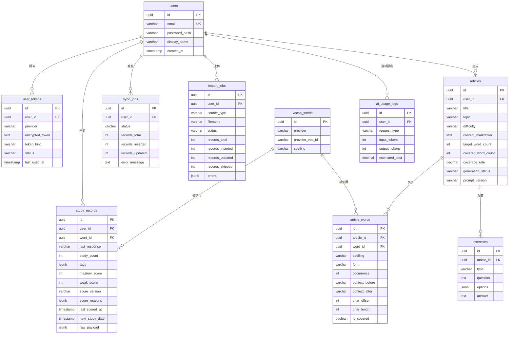

# 03 · 数据库与评分模型

[← 上一篇：技术栈与架构](02-architecture.md) · [文档导航](README.md) · [下一篇：REST API 与 MaiMemo Client →](04-api.md)

---

## 数据库设计

### 阶段说明

不必一开始建出全部表，按阶段递进：

```text
MVP（单用户）：    users, vocab_words, study_records, articles, article_words
                   ※ users 表只 seed 一行 local-user (固定 UUID)，不开放注册
                   ※ 所有 FK 正常指向 local-user，v0.5 加注册时只是从 1 行变多行
v0.5（多用户）：  + user_tokens, sync_jobs, import_jobs
v1（练习与分析）：+ exercises, ai_usage_logs
```

把 `article_words` 提前到 MVP 是因为文章详情页的目标词高亮、覆盖率、点击查词都依赖它；如果只塞 JSON 进 articles，v1 还要做迁移，得不偿失。

完整 schema 关系如下：



### users（MVP，seed local-user）

保存本产品用户。MVP 阶段启动时 seed 一行：

```text
id            = '00000000-0000-0000-0000-000000000001'  -- 固定 UUID
email         = 'local@localhost'
display_name  = 'Local User'
password_hash = ''  -- MVP 不开放登录，留空
```

v0.5 加注册功能后，新注册用户通过 `/auth/register` 正常写入。schema：

```text
id                uuid primary key
email             varchar unique
password_hash     varchar
display_name      varchar
created_at        timestamp
updated_at        timestamp
deleted_at        timestamp nullable
```

### user_tokens（v0.5）

保存第三方 API Token。Token 必须加密存储。

```text
id                uuid primary key
user_id           uuid references users(id)
provider          varchar
encrypted_token   text
token_hint        varchar
status            varchar
created_at        timestamp
updated_at        timestamp
last_used_at      timestamp nullable
deleted_at        timestamp nullable
```

说明：

```text
provider: maimemo
token_hint: 只保存末尾 4 位或哈希摘要，便于用户识别
status: active / invalid / revoked
```

### vocab_words（MVP）

保存单词基础信息。

```text
id                uuid primary key
provider          varchar
provider_voc_id   varchar(255)
spelling          varchar
created_at        timestamp
updated_at        timestamp
unique(provider, provider_voc_id)
```

#### provider / provider_voc_id 的取值约定

为了让 `unique(provider, provider_voc_id)` 在不同数据源下都能稳定 upsert，约定：

| 来源 | provider | provider_voc_id |
|---|---|---|
| 墨墨 API 同步（MVP）| `maimemo` | 上游返回的 `voc_id` |
| CSV 导入（v0.5）| `csv` | `sha256(normalize(spelling))[:16]` |
| Anki .apkg 导入（v0.5）| `anki` | 优先 `note_id`；无则 `sha256(deck_name + ':' + normalize(spelling))[:16]` |
| ECDICT seed（v2）| `ecdict` | `sha256(normalize(spelling))[:16]` |

`normalize(spelling)`：trim + 转小写 + 折叠空白。

`study_records.unique(user_id, provider, provider_voc_id)` 同样适用 — 同一用户对同一 provider 的同一词只会有一条记录，重复导入走 UPSERT 而不是新增。

> 不同 provider 来的同一拼写词会有多个 vocab_words 行（spelling="apple" 在 maimemo / csv / anki 各占一行）。这是有意为之，因为它们的元数据可能不同（释义、标签、来源时间）。需要去重展示时，前端按 spelling 聚合即可。

#### v2 扩展字段（考试专项时引入）

v2 做考试专项时从 [ECDICT](https://github.com/skywind3000/ECDICT)（MIT 协议，商业可用）一次性 seed 词频与考试标签，避免自己维护词表：

```text
cefr              varchar(2) nullable    -- A1/A2/B1/B2/C1/C2
bnc_rank          int nullable           -- BNC 英式词频排名（越小越常用）
coca_rank         int nullable           -- COCA 美式词频排名
collins_star      int nullable           -- 1-5 Collins 星级
oxford_3000       boolean default false  -- 牛津核心 3000 词
exam_tags         jsonb default '[]'     -- ["cet4", "ielts", ...]
ecdict_synced_at  timestamp nullable
```

ECDICT 的 `tag` 字段已经覆盖中考/高考/CET4/CET6/考研/雅思/托福/GRE，不需要 AI 标注或人工维护。lemma 版几十 MB，PostgreSQL `COPY` 一次性导入约 770k 行只要几分钟。

应用：

- `weak_score` 加 `exam_match_bonus: +30 if target_exam in exam_tags`
- 选词策略按 `cefr` 精确分档，不再只靠 prompt 模糊提示
- 词频用于排序"最常用但用户没掌握的词"

### study_records（MVP）

保存用户的单词学习记录。

```text
id                 uuid primary key
user_id            uuid references users(id)
word_id            uuid references vocab_words(id)
provider           varchar
provider_voc_id    varchar(255)
last_response      varchar
study_count        int
tags               jsonb
add_date           timestamp nullable
first_study_date   timestamp nullable
last_study_date    timestamp nullable
next_study_date    timestamp nullable
mastery_score      int
weak_score         int
score_version      varchar              -- "v1" / "v2"，标记当前分数用哪套规则算的
score_reasons      jsonb                -- {"FORGET":100,"STICKING":50,"due_today":20}
last_scored_at     timestamp
raw_payload        jsonb
synced_at          timestamp
created_at         timestamp
updated_at         timestamp
unique(user_id, provider, provider_voc_id)
```

`score_version` / `score_reasons` / `last_scored_at` 三件套是为了：

1. **可解释性** — 前端能展示"为什么这个词薄弱"，把 `score_reasons` 渲染成分项标签
2. **可重算** — 调整权重后用 `score_version` 区分新旧数据，可以离线批量重算而不破坏历史
3. **A/B 测试** — 灰度新规则时，部分用户用 v1 部分用 v2，对比留存效果

### sync_jobs（v0.5）

保存同步任务状态。

```text
id                 uuid primary key
user_id            uuid references users(id)
provider           varchar
status             varchar
records_total      int
records_inserted   int
records_updated    int
error_message      text nullable
started_at         timestamp nullable
finished_at        timestamp nullable
created_at         timestamp
updated_at         timestamp
```

状态：

```text
queued
running
succeeded
failed
cancelled
```

### import_jobs（v0.5）

保存 CSV / Anki 导入任务状态。schema 与 sync_jobs 几乎对称，单独建表是为了让两套异步任务的字段、索引、监控可以独立演进（例如导入要存上传文件名、源类型，同步要存 provider）。

```text
id                 uuid primary key
user_id            uuid references users(id)
source_type        varchar              -- csv / anki
filename           varchar              -- 用户上传的文件名（便于他识别历史）
file_size_bytes    int
status             varchar              -- queued / running / succeeded / failed / cancelled
records_total      int
records_inserted   int
records_updated    int
records_skipped    int                  -- 重复、格式错误、解析失败的行数
errors             jsonb                -- [{row: 12, message: "spelling 为空"}]
started_at         timestamp nullable
finished_at        timestamp nullable
created_at         timestamp
updated_at         timestamp
```

API `GET /imports/:id` 直接返回此表行的脱敏视图（filename 保留，errors 保留前 100 条避免响应过大）。

### articles（MVP）

保存 AI 生成文章。

```text
id                 uuid primary key
user_id            uuid references users(id)
title              varchar
topic              varchar
difficulty         varchar
content_markdown   text
summary            text
target_word_count  int
covered_word_count int
coverage_rate      decimal
generation_status  varchar
model_name         varchar
prompt_version     varchar
created_at         timestamp
updated_at         timestamp
deleted_at         timestamp nullable
```

### article_words（MVP）

保存文章使用的目标词。MVP 必备，文章详情页的高亮、覆盖率、点击查词都靠它。

**关键约定：每个目标词都写一行**，无论覆盖与否：

```text
覆盖成功：is_covered=true,  char_offset/char_length/form/context_* 全部填写
覆盖失败：is_covered=false, char_offset/char_length=null, form 可为 null
```

这样：
- 文章详情页可以稳定展示"哪些目标词没出现"
- 覆盖率可从表重算：`COUNT(is_covered=true) / COUNT(*)`
- **每次 `POST /articles/generate` 创建一行新 articles + 一组新 article_words，从不 UPDATE 已有行**。"重新生成"是发新请求拿新 article_id，旧文章保留。详见 [04-api.md](04-api.md) 的"文章生成的生命周期约定"
- `unique(article_id, word_id)` 是**防御性约束** — 正常流程下永远不会触发，触发了说明有 bug（重复 INSERT 同一 article_id），正好让 DB 报错快速暴露

```text
id                 uuid primary key
article_id         uuid references articles(id)
word_id            uuid references vocab_words(id)
spelling           varchar              -- 目标词原型，如 "competent"
form               varchar nullable     -- 实际出现形态，如 "competence"
occurrence         int nullable         -- 第几次出现（1, 2, ...）
context_before     varchar(64) nullable -- 前置上下文，verbatim 复制自 content_markdown
context_after      varchar(64) nullable -- 后置上下文，verbatim 复制自 content_markdown
char_offset        int nullable         -- form 起点偏移，Unicode code point
char_length        int nullable         -- form 长度，Unicode code point
is_covered         boolean
created_at         timestamp
unique(article_id, word_id)
```

定位方式见 [05-ai-workflow.md](05-ai-workflow.md)：AI 返回 verbatim 的 `context_before + form + context_after`，后端 IndexOf 拼接串一次定位，避免在多语言/Markdown 文本上踩字节 vs rune vs UTF-16 的坑。

`char_offset` 与 `char_length` **必须以 Unicode code point 为单位**，前端用 `Array.from(content)` 切分，不要直接用 `String.length`。

### exercises（v1）

保存文章相关练习。

```text
id                 uuid primary key
article_id         uuid references articles(id)
type               varchar
question           text
options            jsonb nullable
answer             text
explanation        text
target_words       jsonb
created_at         timestamp
updated_at         timestamp
```

练习类型：

```text
reading_comprehension
fill_blank
word_usage
translation
summary
```

### ai_usage_logs（v1）

保存 AI 调用用量，便于后续做成本控制。

```text
id                 uuid primary key
user_id            uuid references users(id)
provider           varchar
model_name         varchar
request_type       varchar
input_tokens       int
output_tokens      int
estimated_cost     decimal
status             varchar
created_at         timestamp
```

不要保存完整敏感 prompt，或者只保存脱敏版本。

## 掌握度与薄弱词评分

墨墨开放 API 返回的是学习状态，不直接提供一个字段叫"熟练度"。本项目需要定义自己的评分模型。

### mastery_score

`mastery_score` 表示掌握度，范围 0 到 100，越高表示越熟。

基础分：

```text
WELL_FAMILIAR: 95
FAMILIAR:      75
VAGUE:         45
FORGET:        20
UNKNOWN:       50
```

修正项：

```text
STICKING 标签: -25
study_count >= 10 且 last_response = FORGET: -10
next_study_date <= today: -5
next_study_date >= today + 30 days: +5
```

最终：

```text
mastery_score = clamp(base + modifiers, 0, 100)
```

### weak_score

`weak_score` 表示 AI 生成文章时的优先级，越高越应该被选中。

示例规则：

```text
FORGET:        +100
VAGUE:          +80
FAMILIAR:       +20
WELL_FAMILIAR:  -30
STICKING:       +50
study_count:    +min(study_count, 30)
due_today:      +20
due_soon:       +10
```

最终：

```text
weak_score = response_weight + tag_bonus + count_bonus + due_bonus
```

### 选词策略

文章生成时不要只按分数从高到低拿词，否则文章可能非常生硬。建议混合策略：

```text
70% 高 weak_score 词
20% 中等掌握词
10% 用户最近学过的新词
```

> 70/20/10 是 v0 默认配置，没有数据支持，仅作为初版起点。上线后需要基于真实文章质量、用户反馈和复习留存做 A/B 调整。`score_version`（评分规则版本）和 `prompt_version`（生成策略版本）字段就是为这种调整保留的：换规则不破坏老数据，能离线重算并对比效果。

同时限制：

```text
短文：15 到 25 个目标词
中等文章：25 到 40 个目标词
长文：40 到 80 个目标词
```

---

[← 上一篇：技术栈与架构](02-architecture.md) · [文档导航](README.md) · [下一篇：REST API 与 MaiMemo Client →](04-api.md)
