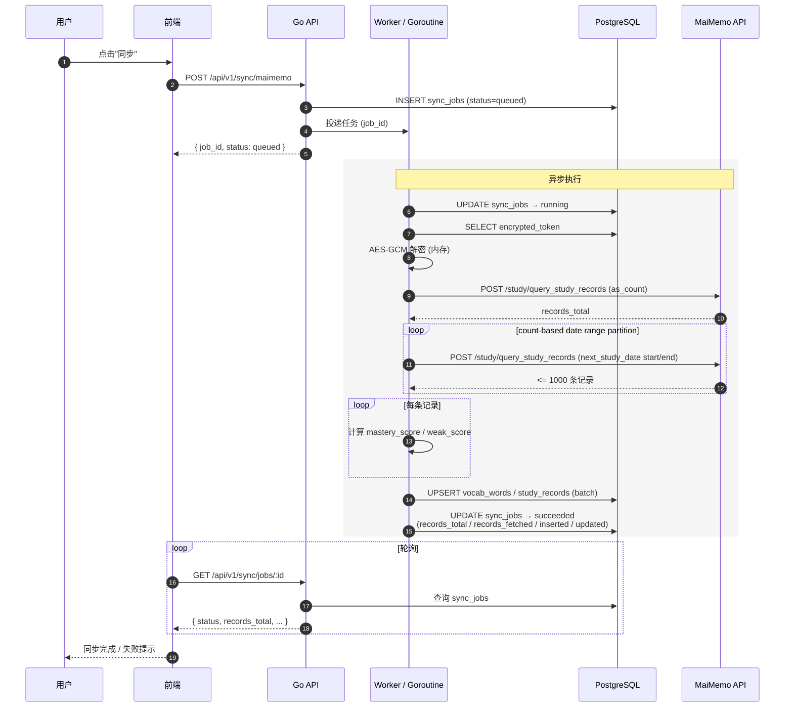
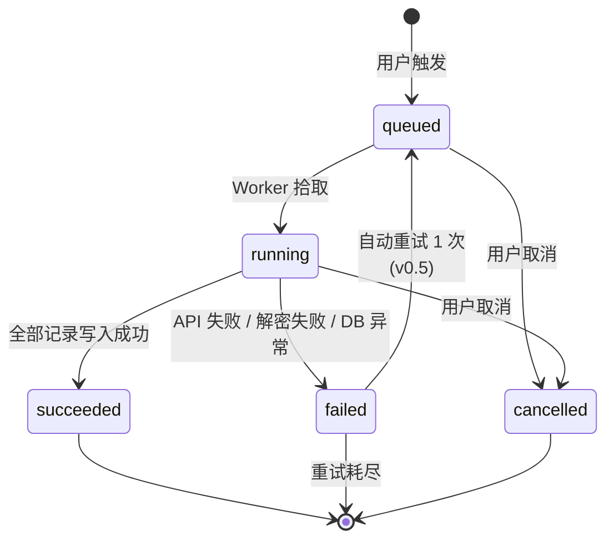

# 04 · REST API 与 MaiMemo Client

[← 上一篇：数据库与评分模型](03-database.md) · [文档导航](README.md) · [下一篇：AI 生成工作流 →](05-ai-workflow.md)

---

## 后端 API 设计

所有接口统一前缀：

```text
/api/v1
```

### 端点速查表

| Method | Path | 用途 | 阶段 |
|---|---|---|---|
| POST | `/auth/register` | 注册 | v0.5 |
| POST | `/auth/login` | 登录 | v0.5 |
| POST | `/auth/logout` | 登出 | v0.5 |
| GET | `/auth/me` | 当前用户 | v0.5 |
| POST | `/integrations/maimemo/token` | 保存 Token | v0.5 |
| GET | `/integrations/maimemo/status` | Token 状态 | v0.5 |
| DELETE | `/integrations/maimemo/token` | 解除绑定 | v0.5 |
| POST | `/sync/maimemo` | 触发同步（MVP 同步 / v0.5 异步） | MVP |
| GET | `/sync/jobs/:id` | 同步任务状态 | v0.5 |
| GET | `/sync/latest` | 最近同步信息 | MVP |
| GET | `/vocab/records` | 单词列表 | MVP |
| GET | `/vocab/weak` | 薄弱词列表 | MVP |
| GET | `/vocab/summary` | 单词总览 | MVP |
| GET | `/vocab/:id` | 单词详情 | MVP |
| POST | `/articles/generate` | 生成文章（不含练习题） | MVP |
| GET | `/articles` | 文章列表 | MVP |
| GET | `/articles/:id` | 文章详情 | MVP |
| DELETE | `/articles/:id` | 删除文章 | MVP |
| POST | `/articles/:id/exercises` | 为已有文章生成练习题 | v1 |
| GET | `/articles/:id/exercises` | 文章练习 | v1 |
| POST | `/exercises/:id/attempts` | 提交答案 | v1 |
| GET | `/exercise-attempts` | 答题历史 | v1 |
| GET | `/export/vocab.csv` | 导出词表 | v0.5 |
| GET | `/export/weak-words.csv` | 导出薄弱词 | v0.5 |
| GET | `/articles/:id/export.md` | 导出文章 Markdown | MVP |
| POST | `/imports/vocab.csv` | 导入 CSV 词表 | v0.5 |
| POST | `/imports/anki.apkg` | 导入 Anki 词包 | v0.5 |
| GET | `/imports/:id` | 导入任务状态 | v0.5 |
| GET | `/imports/latest` | 最近导入信息 | v0.5 |

### Auth

```text
POST /api/v1/auth/register
POST /api/v1/auth/login
POST /api/v1/auth/logout
GET  /api/v1/auth/me
```

登录成功后建议使用 HttpOnly Cookie 或短期 Access Token + Refresh Token。

### MaiMemo Token

```text
POST   /api/v1/integrations/maimemo/token
GET    /api/v1/integrations/maimemo/status
DELETE /api/v1/integrations/maimemo/token
```

保存 Token 请求：

```json
{
  "token": "user-provided-token"
}
```

响应：

```json
{
  "provider": "maimemo",
  "status": "active",
  "token_hint": "****abcd"
}
```

### 同步

```text
POST /api/v1/sync/maimemo
GET  /api/v1/sync/jobs/:id     (v0.5)
GET  /api/v1/sync/latest
```

**MVP：同步执行**。POST 直接阻塞到拉完，返回结果：

```json
{
  "status": "succeeded",
  "records_total": 1079,
  "records_fetched": 1079,
  "records_inserted": 12,
  "records_updated": 1067,
  "duration_ms": 1840
}
```

当上游报告的总量大于后端可通过 `next_study_date` 分页取回的记录数时，响应会额外返回：

```json
{
  "records_unavailable": 3,
  "warning": "MaiMemo reports more records than can be paginated by next_study_date; records without next_study_date may be unavailable through the documented sync filters."
}
```

**v0.5：异步任务**。POST 立即返回 `job_id`，前端轮询 `/sync/jobs/:id`：

```json
{
  "job_id": "uuid",
  "status": "queued"
}
```

升级到 v0.5 时，MVP 客户端的同步调用应当继续工作 — 服务端可以选择同时支持两种返回（基于 `Accept` header 或 query 参数 `async=true`），或者直接破坏式升级（反正 MVP 是单用户、本地）。

### 单词记录

```text
GET /api/v1/vocab/records
GET /api/v1/vocab/weak
GET /api/v1/vocab/summary
GET /api/v1/vocab/:id
```

查询参数：

```text
page
page_size
last_response
tag
min_weak_score
sort
```

薄弱词响应示例：

```json
{
  "items": [
    {
      "id": "uuid",
      "spelling": "competent",
      "last_response": "FORGET",
      "study_count": 14,
      "tags": ["STICKING"],
      "mastery_score": 0,
      "weak_score": 164,
      "next_study_date": "2026-04-26T00:00:00+08:00"
    }
  ],
  "total": 233
}
```

### 文章生成

```text
POST   /api/v1/articles/generate
GET    /api/v1/articles
GET    /api/v1/articles/:id
DELETE /api/v1/articles/:id
```

MVP 生成请求（**只生成文章，不带练习题**）：

```json
{
  "topic": "campus life",
  "difficulty": "B1-B2",
  "target_word_count": 30,
  "article_length": "medium",
  "target_word_ids": ["uuid-1", "uuid-2", "..."]
}
```

字段说明：

- `target_word_ids` **可选**。传了就**优先**使用用户选的词；如果数量少于 `target_word_count`，剩余名额按 70/20/10 自动补齐。不传则完全自动选词。
- 这个字段对应前端薄弱词页的"勾选生成"功能，没有它前端就只能做"看一看"，UX 价值大打折扣。
- 后端要校验 `target_word_ids` 都属于当前用户（防越权）。

### 数量约束

```text
15 ≤ target_word_count ≤ 80
0  ≤ len(target_word_ids) ≤ target_word_count
```

上限 80 与文章长度档位的 long 上限对齐（见 [03-database.md](03-database.md) 选词策略）。超过上限文章质量不可控，AI 强行塞词会出现生硬列表式段落。

### 错误响应

**`len(target_word_ids) > target_word_count`** → 422：

```json
{
  "code": "TARGET_WORDS_EXCEED_COUNT",
  "message": "已勾选 50 个词，超过目标词数 30。请减少勾选或选择更长的文章长度。",
  "details": {
    "selected": 50,
    "target_word_count": 30,
    "suggested_length": "long"
  }
}
```

**`len(target_word_ids) > 80`** 或 **`target_word_count > 80`** → 422：

```json
{
  "code": "TARGET_WORDS_TOO_MANY",
  "message": "目标词数超过单篇上限 80。请拆分成多篇文章生成。",
  "details": {
    "selected": 150,
    "max_per_article": 80
  }
}
```

前端应在调整滑块时实时校验，提交按钮 disable + 红字提示，不要等后端返回。后端的 422 是兜底防御。

### 文章生成的生命周期约定

**每次 `POST /articles/generate` 都创建一行新的 articles + 一组新的 article_words。** 没有 `PUT /articles/:id` 也没有 `/articles/:id/regenerate` 端点。

前端"重新生成"按钮的实现：

```text
1. 取出当前文章的 topic / difficulty / target_word_count / article_length / target_word_ids
2. POST /articles/generate 复用同一组参数
3. 拿到 new_article_id，navigate 到 /articles/{new_article_id}
4. 旧文章保留在历史里，用户可在 /articles 列表手动删除
```

好处：

- article_words 只 INSERT 不 UPDATE/DELETE，事务简单，`unique(article_id, word_id)` 永远不触发冲突
- 用户能对比新旧两版（开两个 tab），对学英语反而有价值
- 用户掌握主动权 — 想清理就去历史页删
- v0.5 多用户后，如有需要再加"最多保留 N 篇自动清理"

生成响应：

```json
{
  "article_id": "uuid",
  "status": "succeeded",
  "covered_word_count": 29,
  "target_word_count": 30,
  "coverage_rate": 0.9667
}
```

v1 引入练习题后，新增独立端点 `POST /articles/:id/exercises`（携带 `exercise_types` 参数），不污染 MVP 的生成流程。

### 练习（v1）

```text
POST /api/v1/articles/:id/exercises    -- 为已有文章生成练习题
GET  /api/v1/articles/:id/exercises    -- 列出该文章的练习题
POST /api/v1/exercises/:id/attempts    -- 提交答题
GET  /api/v1/exercise-attempts         -- 答题历史
```

生成请求：

```json
{
  "exercise_types": ["reading_comprehension", "fill_blank"]
}
```

### 导出

```text
GET /api/v1/export/vocab.csv
GET /api/v1/export/weak-words.csv
GET /api/v1/articles/:id/export.md
```

### 导入（v0.5）

去除墨墨 API 单点依赖的关键能力。详见 [01-product.md](01-product.md) "为什么 CSV/Anki 导入是 v0.5 而不是 v1"。

```text
POST /api/v1/imports/vocab.csv      multipart/form-data
POST /api/v1/imports/anki.apkg      multipart/form-data
GET  /api/v1/imports/:id            导入任务状态
GET  /api/v1/imports/latest         最近导入信息
```

CSV 格式约定：

```csv
spelling,translation,last_response,study_count,tags
competent,胜任的,FORGET,14,STICKING
ascertain,确认,VAGUE,5,
```

字段说明：

- `spelling` 必填，其它字段可空
- `last_response` 缺省视为 UNKNOWN，进入正常评分流程
- `tags` 用 `;` 分隔多个标签

POST 立即返回 import_id（异步处理同 sync_jobs 模式）：

```json
{
  "import_id": "uuid",
  "status": "queued",
  "estimated_records": 1234
}
```

GET `/imports/:id` 返回处理结果：

```json
{
  "import_id": "uuid",
  "status": "succeeded",
  "records_total": 1234,
  "records_inserted": 1100,
  "records_updated": 134,
  "records_skipped": 0,
  "errors": []
}
```

Anki `.apkg` 是 zip 压缩的 SQLite 数据库。Go 后端解析步骤：

```text
1. archive/zip 解包 .apkg → 得到 collection.anki2 (SQLite 数据库) + media 文件
2. database/sql + mattn/go-sqlite3 打开 collection.anki2
3. 读取 notes 表（每行一个笔记，含正反面字段）和 cards 表（每个 note 可派生多张卡片）
4. 对每条 note 提取 spelling（正面）+ translation（反面）+ tags
5. 按 docs/03-database.md 的 provider/provider_voc_id 约定 upsert 到 vocab_words 与 study_records
```

注意：**AnkiConnect** 是 Anki 桌面端的插件 API（让外部程序与运行中的 Anki 通信），与"解析 .apkg 文件"无关。后端解包用标准库 + SQLite 驱动即可，没有合适的 Go 专用 .apkg parser，但 SQLite 直读已足够简单。

## MaiMemo API Client 设计

Go 后端应该封装一个独立 client，不要在 handler 里直接写 HTTP 请求。

### Client 接口

```go
type Client interface {
    GetStudyProgress(ctx context.Context, token string) (*StudyProgress, error)
    QueryStudyRecords(ctx context.Context, token string, req QueryStudyRecordsRequest) (*QueryStudyRecordsResponse, error)
    GetTodayItems(ctx context.Context, token string, req GetTodayItemsRequest) (*GetTodayItemsResponse, error)
}
```

### 必要能力

- `context.Context` 超时控制
- 官方限流保护
- 失败重试
- 错误分类
- Authorization Header 脱敏
- 单元测试可 mock

### 同步策略

**MVP：手动全量**

```text
POST /study/query_study_records
body: {"as_count": true}

POST /study/query_study_records
body: {
  "next_study_date": {
    "start": "1900-01-01T00:00:00+08:00",
    "end": "9999-12-31T23:59:59+08:00"
  },
  "as_count": true
}
```

MVP 阶段每次同步仍是手动全量同步，但不能假设一次 `limit: 1000` 能拉完，也不能把上游返回的最后一条记录当分页游标。真实 MaiMemo API 行为要求：

- `query_study_records` 的 `limit` 最大为 1000。
- `next_study_date.start` 与 `next_study_date.end` 都是包含边界。
- 返回列表不能可靠视为按 `next_study_date` 升序，即使传了日期过滤。
- 全量同步先获取总数，再对 `next_study_date` 范围做 count-based partition：某个范围 `count <= 1000` 时拉取该范围；超过 1000 时二分范围继续递归。
- 由于日期边界包含，后端按上游 `voc_id` 去重后再 upsert。

后端写库使用 GORM 批量 upsert：先批量写 `vocab_words`，再按 `(provider, provider_voc_id)` 取回 word id，最后批量 upsert `study_records`。这样重复全量同步不会插入重复行，也能把 nullable 日期字段更新为 null。

**MVP 防误触保护**（不是真正的限流）：

- 前端"同步"按钮点击后冷却 30 秒（按钮 disable + 倒计时）
- 后端 in-memory 防抖（同一进程内 5 秒内重复请求直接返回上次结果）

**v0.5 起加正式限流**：基于 Redis 的按用户/IP 持久限流，每用户每 5 分钟 1 次同步，超出返回 429。详见 [07-security.md](07-security.md) 的 API 限流节。

**v0.5：增量 + 状态追踪**

- 引入 `sync_jobs` 表追踪同步状态（queued/running/succeeded/failed）
- 基于 `last_study_date` 做增量同步，仅拉取上次同步后变更的记录
- 失败任务自动重试 1 次

**v1：定时调度**

- 后台定时同步（默认每天 1 次，用户可关闭）
- 同步失败邮件提醒

### 同步时序图（v0.5 异步版本）



### sync_jobs 状态机



---

[← 上一篇：数据库与评分模型](03-database.md) · [文档导航](README.md) · [下一篇：AI 生成工作流 →](05-ai-workflow.md)
