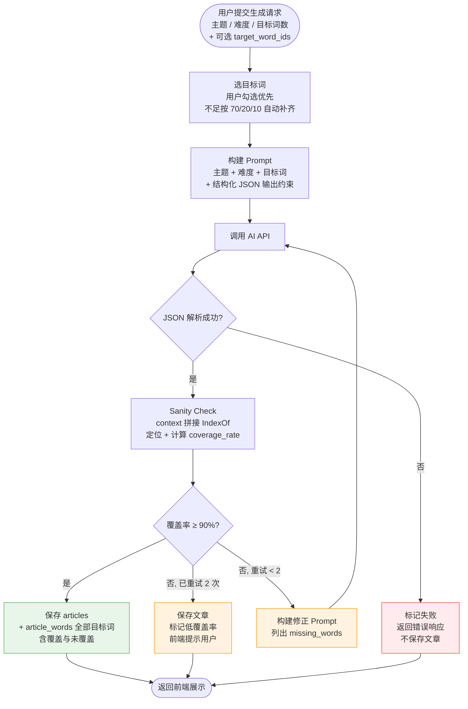
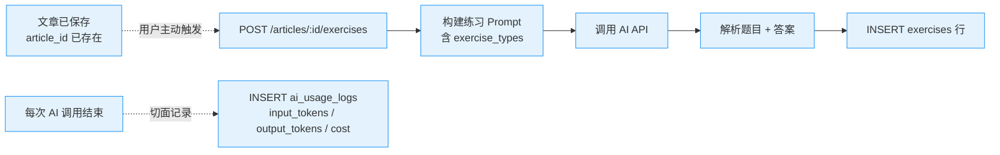

# 05 · AI 生成工作流

[← 上一篇：REST API 与 MaiMemo Client](04-api.md) · [文档导航](README.md) · [下一篇：前端设计 →](06-frontend.md)

---

## 流程

### MVP 主流程



二次修正最多 1-2 次，避免成本失控；超出后保存为低覆盖率文章并提示用户而不是无限重试。

### v1 扩展：练习题与用量统计

v1 阶段 MVP 主流程**不变**，新增两条独立路径，互不污染：



练习题生成是**独立端点**，不污染 MVP 文章生成流程。`ai_usage_logs` 也是 v1 才加；MVP 阶段单用户、env Token，不需要做成本统计与多租户用量隔离。

## Prompt 原则

Prompt 中需要明确：

- 文章难度（CEFR 等级 A2/B1/B2/C1）
- 文章主题
- 目标词列表
- 必须自然使用目标词，不要写成单词列表
- 首次出现目标词时加粗
- 输出固定结构 JSON（见下节）

MVP 阶段 prompt **只生成文章**。练习题（阅读理解、填空题）放到 v1 通过独立端点 `POST /articles/:id/exercises` 触发，不污染主生成流程。

## 目标词覆盖率检测

不要在后端自己写词形还原（lemmatization）匹配 spelling，对屈折变化（run/ran/running、competent/competence）会大量误判，导致覆盖率虚低、频繁触发二次修正、AI 成本失控。

**正确做法：让 AI 在生成时直接返回目标词的 form + 逐字复制的上下文片段，后端用 IndexOf 一次定位。**

要求 AI 输出固定 JSON：

```json
{
  "title": "...",
  "content_markdown": "...",
  "covered_words": [
    {
      "spelling": "competent",
      "form": "competence",
      "occurrence": 1,
      "context_before": "demonstrates remarkable ",
      "context_after": " in solving complex"
    },
    {
      "spelling": "ascertain",
      "form": "ascertained",
      "occurrence": 1,
      "context_before": "the team has ",
      "context_after": " the root cause"
    }
  ],
  "missing_words": ["compose"]
}
```

字段说明：

- `spelling`：目标词原型（与请求一致，便于后端比对）
- `form`：实际出现形态（处理屈折/词族）
- `occurrence`：第几次出现（1, 2, ...），用于同一个 form 出现多次时定位特定位置
- `context_before` / `context_after`：**必须是 `content_markdown` 中 form 前后各 15-30 字符的逐字复制**（包含空格、标点），不允许概括/改写

Prompt 必须显式约束 verbatim：

```text
For each covered word, context_before MUST be the exact verbatim characters
immediately preceding `form` in content_markdown, and context_after MUST be
the exact verbatim characters immediately following `form`. Copy them
character-by-character. Do not summarize or paraphrase.
```

后端的 sanity check：

```text
1. needle = context_before + form + context_after
2. 在 content_markdown 中 IndexOf(needle)
   - 找到（取第 occurrence 次匹配）→ 计算 form 在原文中的起止偏移：
     start = (needle 起点 + len(context_before))，按 Unicode code point
     end   = start + len(form)，按 Unicode code point
     写入 article_words.char_offset / char_length，is_covered = true
   - 找不到 → 视为虚报，把 spelling 加入 missing_words 触发修正
3. 对未出现在 covered_words 也未出现在 missing_words 的目标词：补齐到 missing_words
4. coverage_rate = len(成功定位) / target_word_count
```

为所有目标词都写一行 `article_words`：覆盖成功 → `is_covered=true` + 偏移；覆盖失败 → `is_covered=false` + `char_offset=null`。这样文章详情页可以稳定展示"哪些词没覆盖"，覆盖率也可从表 `COUNT(is_covered=true) / COUNT(*)` 重算。

### 为什么用 verbatim context 而不是 position 数字

- **byte vs rune vs UTF-16 vs 显示字符**：在多语言/Markdown/含 emoji 的文本上，AI 自己也数不准
- **AI 数错也能恢复**：context 锚定的是字符串内容，不是数值
- **二次修正后位置变化**：context 自动随文本走，不需要重算
- **Sanity check 同时验证内容真实性**：context 找不到 → 模型在虚报

### 偏移类型与前端渲染

后端写入 `article_words` 的 `char_offset` 与 `char_length` **均为 Unicode code point 单位**。前端不能直接用 `String.length` 切分（JS 字符串是 UTF-16 code unit，遇到 emoji / 罕用 CJK 扩展字符会错位 2 倍）。

前端高亮的标准模式：

```javascript
// 把整篇文章按 code point 切成数组
const codepoints = Array.from(article.content_markdown);

// 每个目标词渲染一段 <mark>
const segment = codepoints
  .slice(word.char_offset, word.char_offset + word.char_length)
  .join('');
```

或后端在响应时直接返回切好的 `highlight_ranges: [{start, end, word_id}]`，前端不感知 offset 单位。MVP 走前者，v1 如果需要更复杂的渲染再做后者。

## 二次修正

如果目标词覆盖率低于阈值，例如 90%，则向 AI 发起修正请求：

```text
The article missed these words: ...
Revise the article naturally and include all missing words.
Keep the original topic and difficulty.
```

最多修正 1 到 2 次，避免成本失控。

---

[← 上一篇：REST API 与 MaiMemo Client](04-api.md) · [文档导航](README.md) · [下一篇：前端设计 →](06-frontend.md)
