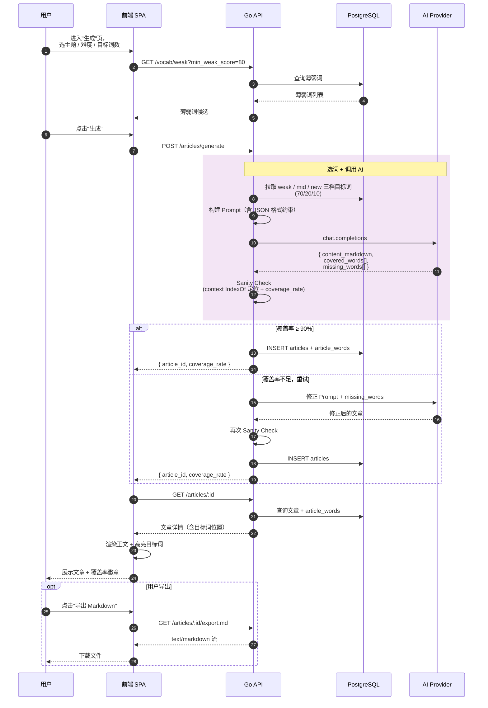

# 06 · 前端设计

[← 上一篇：AI 生成工作流](05-ai-workflow.md) · [文档导航](README.md) · [下一篇：安全与错误处理 →](07-security.md)

---

## 页面结构

按阶段分组：

```text
MVP（4 周内）
  /dashboard          总单词数 / 薄弱词数量 / 最近文章
  /vocab              全部单词
  /vocab/weak         薄弱词列表
  /articles           文章历史
  /articles/new       生成文章
  /articles/:id       文章详情（高亮 + 覆盖率 + Markdown 导出）

v0.5（多用户）
  /login              登录
  /register           注册
  /integrations       墨墨 Token 配置（替代 env 配置）
  /imports            CSV / Anki 导入页（去除墨墨 API 单点依赖）
  /settings           账号 / 数据删除

v1（练习与分析）
  /articles/:id/exercises   阅读理解 / 填空
  /reports                  学习报告 / 周报月报
```

MVP 阶段没有"登录"按钮，没有"设置"页 — Token 只能用环境变量配。这是有意为之：把鉴权与多用户复杂度推迟到 Demo 稳定之后再做。

## Dashboard（MVP）

展示：

- 总单词数
- 薄弱词数量
- 今日进度
- 最近同步时间
- 最近生成文章
- 下次建议复习

## 薄弱词页面（MVP）

功能：

- 表格展示单词
- 按 `last_response` 筛选
- 按 `STICKING` 筛选
- 按 `weak_score` 排序
- 勾选目标词生成文章（通过 `POST /articles/generate` 的可选字段 `target_word_ids` 提交）
- 导出 CSV（v0.5）

## 文章生成页面（MVP）

控件：

- 主题选择
- 难度选择：A2 / B1 / B2 / C1
- 目标词数量（`target_word_count`）
- 文章长度（短文 / 中等 / 长文）
- 生成按钮
- （v1）练习类型选择，调用 `POST /articles/:id/exercises`

### 入口

两个入口共用同一个页面：

```
直达：           /articles/new
从薄弱词页跳转： /articles/new?target_word_ids=uuid-1,uuid-2,...
```

### 默认值联动

页面打开时，根据 URL 是否携带 `target_word_ids` 决定默认参数。`target_word_count` 受单篇上限 80 约束（见 [04-api.md](04-api.md) 数量约束）：

```text
情况 1：未携带 ids（自动选词模式）
  article_length     = 中等
  target_word_count  = 30

情况 2：携带 ids（用户勾选模式）
  N = ids.length
  N > 80          → 红字"已勾选 N 个词，超过单篇上限 80，请拆分成多篇"，按钮 disable
  N ≤ 80：
    article_length 默认值：
      N ≤ 25  → 短文
      26-40   → 中等
      41-80   → 长文
    target_word_count 默认 = clamp(max(N, 各长度档的中位数), 15, 80)
```

### 实时校验

用户调整任一控件时，前端必须保持以下三条约束：

```text
- 15 ≤ target_word_count ≤ 80                             否则按钮 disable
- len(target_word_ids) ≤ 80                               否则按钮 disable + 提示拆分
- len(target_word_ids) ≤ target_word_count                否则按钮 disable + 提示减少勾选或调长
```

调整文章长度时，根据 N 自动推荐 `target_word_count` 默认值，但用户手动调整后不再自动覆盖。

### 提交

```text
POST /articles/generate
{
  topic, difficulty, target_word_count, article_length,
  target_word_ids: [...] | undefined
}
```

后端 422 是兜底，但前端校验通过的请求理论上不会触发 422。

## 文章详情页（MVP）

展示：

- 文章正文
- 目标词高亮（基于 `article_words.char_offset` + `char_length`，按 Unicode code point 切分）
- 覆盖率徽章
- 未覆盖目标词列表（`is_covered=false` 的行，提示"AI 没把这些词写进文章"）
- 导出 Markdown 按钮
- 重新生成按钮
- （v1）阅读理解题、填空题

### "重新生成"按钮行为

不是原地覆盖，而是**用同一组参数发起一次新的生成请求**，旧文章保留在历史里：

```text
1. 弹窗："使用相同参数重新生成一篇？新文章会保存在历史里，旧文章不变。"
2. 确认 → POST /articles/generate（复用 topic / difficulty / target_word_count / article_length / target_word_ids）
3. 拿到 new_article_id → navigate 到 /articles/{new_article_id}
4. 想清理旧文章去 /articles 历史页手动删
```

这样设计便于用户对比新旧两版（同时开两个 tab），对英语学习场景反而是优势。

## 文章生成主流程时序图

把前端、Go 后端、AI、数据库串起来的端到端流程：



---

[← 上一篇：AI 生成工作流](05-ai-workflow.md) · [文档导航](README.md) · [下一篇：安全与错误处理 →](07-security.md)
