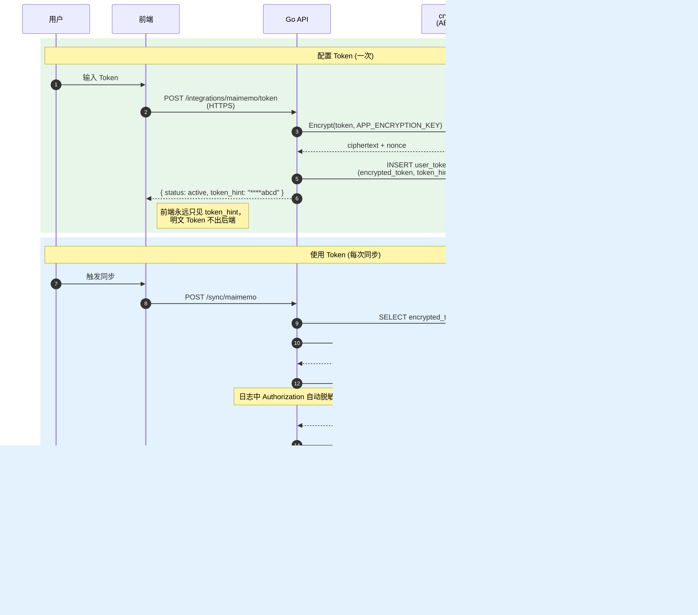

# 07 · 安全与错误处理

[← 上一篇：前端设计](06-frontend.md) · [文档导航](README.md) · [下一篇：部署与测试 →](08-deployment.md)

---

## 安全设计

### Token 加密

**MVP 阶段**：Token 只从环境变量 `MAIMEMO_TOKEN` 读取，不进数据库、不进前端。整个产品没有 user_tokens 表。

**v0.5 起**：用户在前端配置自己的 Token，必须后端加密存储。

加密方案：

```text
AES-256-GCM
nonce(12B) ‖ ciphertext ‖ tag(16B) → base64 入库
```

环境变量：

```text
APP_ENCRYPTION_KEY    32 字节 base64
```

要求（v0.5 起）：

- key 不进入 Git
- key 不进入前端
- token 不打印到日志
- token 不返回给前端
- 删除集成时软删除或彻底删除 token
- 加密格式与 key 轮换方案见下方"v0.5+ 生产硬化清单"

### 认证

建议：

```text
密码使用 bcrypt 或 argon2id
登录态使用 HttpOnly Cookie 或 JWT
生产环境开启 HTTPS
```

### 日志脱敏

必须脱敏：

```text
Authorization
MAIMEMO_TOKEN
OpenAI API Key
用户密码
第三方 Token
```

### API 限流

**MVP 阶段不做后端限流**，只用最便宜的 UX 防误触：

- 前端按钮冷却（同步按钮点完 30 秒不可重复点）
- 后端 in-memory 防抖（同进程 5 秒内重复请求返回上次结果）

单用户场景下不需要更重的方案。

**v0.5 起加正式限流**（基于 Redis，按用户 ID 与 IP 持久化）：

```text
登录接口：    按 IP 限流，每分钟 5 次
注册接口：    按 IP 限流，每小时 3 次
同步接口：    每用户每 5 分钟 1 次
文章生成：    每用户每日额度（结合 v1 的 ai_usage_logs）
AI 接口：     按会员等级配额（商业化阶段）
```

超限返回 `429 Too Many Requests`，响应头 `Retry-After` 标注秒数。

### 删除权

用户必须可以删除：

- 第三方 Token
- 同步的学习记录
- AI 生成文章
- 账号数据

### Token 生命周期时序图



明文 Token 只在内存停留单次请求时长，DB / 日志 / 前端三处都不会出现。

### v0.5+ 生产硬化清单

下列条目在 MVP 单用户阶段不必实现，但做多用户/上线前必须补齐。先列条目，避免遗漏，到 v0.5 时再展开细节。

- **AES-GCM 存储格式**：约定 `nonce(12B) ‖ ciphertext ‖ tag(16B)` 序列化为 base64 后入库；解密时按固定切片解析，便于 key 轮换时识别版本
- **Key 轮换**：`user_tokens` 加 `key_version` 字段；新 key 上线后双 key 解密窗口 ≥ 30 天，写入只用新 key；老 key 退役前批量重加密
- **CSRF 防护**：使用 Cookie 登录时 `SameSite=Strict + Secure + HttpOnly`，所有状态变更接口校验 CSRF token 或 Origin/Referer 白名单
- **CORS allowlist**：生产环境 `Access-Control-Allow-Origin` 严格白名单（不允许 `*`），凭据请求显式 `Allow-Credentials: true`
- **账号删除保留期**：`deleted_at` 软删除 30 天，期满后批处理硬删（含 study_records / articles / user_tokens 全部级联）
- **AI Provider 数据披露**：首次调用 AI 前弹窗确认"将向第三方 AI 服务发送薄弱词、主题与难度（不含 Token 与个人身份信息）"，记录用户同意时间到 `users.ai_consent_at`
- **密钥与凭证管理**：`APP_ENCRYPTION_KEY` / `JWT_SECRET` / `OPENAI_API_KEY` 通过 secret manager（Railway/Render/云服务）注入，绝不进 Git；本地开发用 `.env.local`（已在 `.gitignore`）
- **审计日志**：Token 配置/使用/删除、AI 调用、账号删除等事件单独写 audit 表，保留 90 天

## 错误处理

### 第三方 Token 无效

响应：

```json
{
  "code": "MAIMEMO_TOKEN_INVALID",
  "message": "墨墨 Token 无效或已过期，请重新配置。"
}
```

### 第三方 API 不可用

响应：

```json
{
  "code": "MAIMEMO_API_UNAVAILABLE",
  "message": "暂时无法连接墨墨开放 API，请稍后重试。"
}
```

### AI 生成失败

MVP 响应（无额度概念）：

```json
{
  "code": "AI_GENERATION_FAILED",
  "message": "文章生成失败，请重试。"
}
```

v1 起（接入 ai_usage_logs 与额度后）：

```json
{
  "code": "AI_GENERATION_FAILED",
  "message": "文章生成失败，未消耗额度或已自动退回额度。"
}
```

### 部分同步成功

同步任务需要保存：

```text
records_total
records_inserted
records_updated
error_message
```

方便排查问题。

---

[← 上一篇：前端设计](06-frontend.md) · [文档导航](README.md) · [下一篇：部署与测试 →](08-deployment.md)
