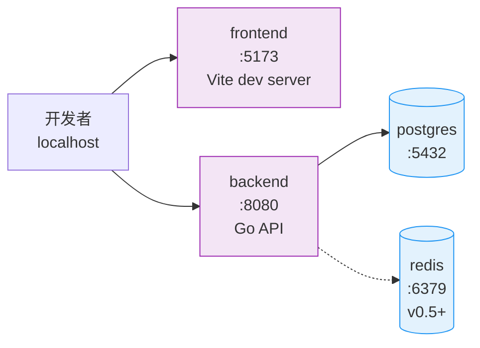

# 08 · 部署与测试

[← 上一篇：安全与错误处理](07-security.md) · [文档导航](README.md) · [下一篇：里程碑与商业化 →](09-roadmap.md)

---

## 部署设计

### 本地开发

Docker Compose 服务编排：



环境变量速查：

| 变量 | 说明 | 阶段 | 示例 |
|---|---|---|---|
| `DATABASE_URL` | PostgreSQL 连接串 | MVP | `postgres://app:pass@db:5432/lexiforge` |
| `MAIMEMO_TOKEN` | 单用户 Token（MVP） | MVP | `mm_xxxxx` |
| `AI_API_KEY` | AI 服务 Key | MVP | `sk-...` |
| `AI_BASE_URL` | AI API 基础地址 | MVP | `https://api.openai.com/v1` |
| `AI_MODEL` | 模型名称 | MVP | `gpt-4o-mini` |
| `APP_PORT` | 后端监听端口 | MVP | `8080` |
| `APP_ENCRYPTION_KEY` | AES-GCM 主密钥（32 字节 base64） | v0.5 | `base64:...` |
| `JWT_SECRET` | JWT 签名密钥 | v0.5 | 随机 64 字节 |
| `REDIS_URL` | Redis 连接串 | v0.5+ | `redis://redis:6379/0` |
| `RATE_LIMIT_RPS` | 全局限流（次/秒） | v0.5 | `5` |
| `LOG_LEVEL` | 日志等级 | MVP | `info` |

注意：`APP_ENCRYPTION_KEY` 和 `AI_API_KEY` 必须在生产环境通过 secret manager 注入，**绝不进入 Git**。

### 生产部署

推荐：

```text
前端：Vercel
后端：Railway / Render / Fly.io / 云服务器
数据库：Supabase PostgreSQL / Railway PostgreSQL
缓存：Upstash Redis / Railway Redis
```

### 备份

至少备份：

- PostgreSQL 数据库
- 用户文章
- 同步记录

不要把明文 Token 导出到备份文件。

## 测试策略

按阶段拆分，避免 MVP 阶段为不存在的功能写测试。

### 单元测试（贯穿所有阶段）

重点测试纯函数与编解码：

- `mastery_score` / `weak_score` 计算（含 score_version / score_reasons）
- AI 输出 JSON 解析与 sanity check（context IndexOf 定位、coverage_rate 计算）
- MaiMemo response 解析（含 raw_payload 字段保留）
- Token 加密和解密（v0.5 起）
- ECDICT CSV 导入解析（v2 起）

### MVP 集成测试

覆盖 4 周内能跑通的端到端：

- 同步墨墨学习记录（同步执行，校验 records_total / inserted / updated）
- 薄弱词查询（按 weak_score 排序、按 last_response 筛选）
- 文章生成（自动选词、用户勾选 target_word_ids 两条路径）
- article_words 写入（含覆盖+未覆盖统一保存、unique 约束）
- Markdown 导出
- 文章历史列表 + 删除

### v0.5 集成测试

- 用户注册 / 登录 / 登出
- 保存 Token（AES-GCM 加密、token_hint 生成、明文 token 不出 DB）
- 异步同步任务（sync_jobs queued → running → succeeded）
- 接口限流（同一用户 5 分钟内重复同步被拒）
- CSV / Anki 导入（生成 vocab_words 与 study_records）

### v1 集成测试

- 练习题生成（POST /articles/:id/exercises）
- 答题与错题追踪（exercises 表 + attempts 关联）
- 答题历史查询

### Mock 外部服务

不要在测试里直接调用真实墨墨 API 或真实 AI API。

需要 mock：

- MaiMemo Open API（返回固定的 992 条样例数据，覆盖 FAMILIAR / FORGET / VAGUE / WELL_FAMILIAR）
- AI Provider API（返回固定的结构化 covered_words JSON，覆盖正常/虚报 context/missing_words 三类场景）

### MVP E2E 测试

覆盖 MVP 用户主流程：

```text
启动后端（env 配 MAIMEMO_TOKEN）
触发同步
查看 Dashboard 总数
进入薄弱词页 → 勾选 5 个词
跳转到生成页 → 选难度 → 生成
进入详情页 → 检查目标词高亮 + 覆盖率 ≥ 90%
导出 Markdown
回到历史页 → 删除文章
```

### v0.5 E2E 测试

```text
注册 → 登录 → 配置 Token UI → 同步 → 查看 Dashboard
上传 CSV → 查看导入状态 → Dashboard / 薄弱词列表出现导入词
```

### v1 E2E 测试

```text
打开历史文章 → 生成练习题 → 答题 → 查看错题
```

---

[← 上一篇：安全与错误处理](07-security.md) · [文档导航](README.md) · [下一篇：里程碑与商业化 →](09-roadmap.md)
