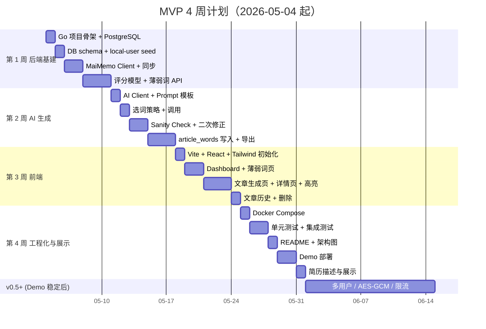

# 09 · 里程碑与商业化

[← 上一篇：部署与测试](08-deployment.md) · [文档导航](README.md)

---

## 里程碑计划

4 周内交付一个**单用户但完整可演示**的 MVP，比 4 周做一个摇摇晃晃的多用户版本简历价值更高。多用户、加密、限流等 v0.5 内容放到 MVP 上线稳定之后再做。



### 第 1 周：后端基建 + 同步 + 评分

- 初始化 Go 项目（cmd/server + internal 分层）
- 接入 PostgreSQL + GORM
- 设计 schema（users with seed local-user / vocab_words / study_records / articles / article_words）
- 实现配置管理（env 读取 `MAIMEMO_TOKEN`、`OPENAI_API_KEY`）
- 实现 MaiMemo Client（context 超时 + 失败分类 + Authorization 脱敏）
- 实现手动全量同步（MVP 同步执行，直接返回 `records_total`）
- 实现 mastery_score / weak_score 计算，写 `score_version` / `score_reasons`
- 提供 `/vocab/weak`、`/vocab/summary` API

第 1 周末：能用 `curl` 看到薄弱词列表。

### 第 2 周：AI 文章生成 + 覆盖率 + 导出

- 接入 AI API（OpenAI 或兼容协议）
- 设计 Prompt 模板（约定结构化 covered_words 输出，含 form / occurrence / context）
- 实现 70/20/10 选词
- 实现 Sanity Check：context IndexOf 定位 → 写入 `article_words.char_offset`
- 实现二次修正（最多 1-2 次）
- 实现 `/articles/generate` 与 `/articles/:id/export.md`

第 2 周末：能用 `curl` 生成一篇文章并下载 Markdown，覆盖率 ≥ 90%。

### 第 3 周：Vite + React 前端端到端

- 初始化 Vite + React + TS 项目
- 配置 Tailwind / shadcn/ui / TanStack Query
- Dashboard：总单词数 / 薄弱词数量 / 最近文章
- 薄弱词页：表格 + 筛选 + 排序 + 勾选生成
- 文章生成页：主题 / 难度 / 目标词数量
- 文章详情页：用 `article_words.char_offset` 高亮目标词 / 覆盖率徽章 / Markdown 导出
- 文章历史列表 + 删除

第 3 周末：浏览器里能完整跑一遍同步 → 选词 → 生成 → 高亮 → 导出。

### 第 4 周：工程化与展示

- Docker Compose（frontend + backend + postgres）
- 单元测试（评分计算、Sanity Check、MaiMemo response 解析）
- 集成测试（同步流程、生成流程）
- README + 架构图（直接复用 docs/ 内的 mermaid）
- 部署 Demo（前端 Vercel / 后端 Railway 或 Fly.io）
- 写简历描述（见后文模板）

第 4 周末：可以投简历，可以分享 Demo 链接。

### v0.5+：MVP 稳定后再做

- 用户注册登录（users 表从 1 行变多行）
- AES-GCM Token 加密 + key 轮换格式
- 同步改异步（sync_jobs）+ 增量同步
- 接口限流 + 日志脱敏
- CSRF / CORS / 账号删除保留期等生产硬化（详见 [07-security.md](07-security.md)）
- **CSV / Excel / Anki .apkg 导入（战略级，去除单点依赖）**
- 错误码体系完善

v1 才做：阅读理解题 / 填空题 / 错题记录 / 每日推荐 / 学习报告

## 商业化设计

### 免费版

- 连接墨墨开放 API
- 查看薄弱词
- 每天生成 1 篇短文章
- 基础练习题（v1+）
- CSV 导出

### 会员版

- 更多文章额度
- 长文生成
- 多主题和考试专项
- 周报/月报
- 错题追踪
- 多模型选择
- PDF 导出
- 高级复习计划

### 成本控制

需要记录：

- 每次 AI 调用 tokens
- 每用户每日生成次数
- 失败重试次数
- 文章长度

避免：

- 无限重试
- 免费用户生成超长文章
- 每次刷新都同步第三方 API

## 风险与应对

### 墨墨官方推出类似功能

风险：高。

应对：

- 不只做墨墨数据源
- 支持 CSV、Excel、Anki、欧路等导入
- 聚焦考试专项和个人阅读兴趣
- 做强 AI 工作流和练习闭环
- 做学习报告和复盘功能

### 第三方 API 变更

风险：中。

应对：

- 封装 provider 层
- 保留 raw_payload
- 接口错误监控
- 支持手动 CSV 导入兜底

### Token 泄露

风险：高。

应对：

- AES-GCM 加密
- 日志脱敏
- 前端不可见
- 删除机制
- 最小权限使用

### AI 成本过高

风险：中。

应对：

- 额度限制
- 缓存
- 文章长度限制
- 低成本模型
- 生成失败不重复无限重试

### 内容质量不稳定

风险：中。

应对：

- 目标词覆盖检测
- 二次修正
- 固定输出格式
- 用户反馈
- Prompt 版本管理

## 开源策略

对学生简历最优策略：

```text
核心项目开源
在线 Demo 可访问
真实密钥和用户数据不开源
商业化能力后续单独闭源
```

建议开源：

- 前端
- Go 后端
- 数据库 schema
- MaiMemo API client
- scoring 算法
- AI workflow
- Docker Compose
- mock 数据
- README 和架构文档

不应开源：

- 生产环境变量
- 真实用户数据
- 真实 Token
- 支付配置
- 生产数据库备份

## 简历描述模板

项目名：

```text
AI Personalized Vocabulary Reading Platform
```

简历描述：

```text
- 使用 Go/Gin 构建后端 API 服务，封装墨墨 Open API Client，通过 count-based date range pagination 同步 1000+ 条真实学习记录并持久化到 PostgreSQL。
- 设计基于 last_response、study_count、tags、next_study_date 的薄弱词评分模型（带 score_version / score_reasons 版本化字段，支持解释和重算），自动识别高优先级复习词。
- 构建 AI 内容生成工作流，根据薄弱词、文章主题和 CEFR 难度生成个性化英文阅读材料；让模型返回 form + occurrence + 上下文片段，后端用 IndexOf 锚定 Unicode code point 偏移，避开词形还原与字节/UTF-16 编码踩坑，目标词覆盖率 ≥ 90%，自动二次修正最多 2 次。
- 后端代理所有第三方调用（Token / AI API Key 不出后端、日志自动脱敏），从设计阶段满足第三方授权数据最小化原则；预留 AES-GCM 加密、key 轮换、CSRF/CORS、数据披露等生产硬化方案。
- 使用 Vite + React + TypeScript 构建前端 SPA，所有数据接口由 Go 后端提供；Docker Compose 管理后端、数据库和缓存服务，支持本地一键启动与云端 Demo 部署。
```

## MVP 验收标准

MVP 完成时，应满足：

- 可以通过环境变量 `MAIMEMO_TOKEN` 配置墨墨 Token（前端 Token 配置页放到 v0.5）
- Token 不会出现在前端响应或日志里
- 可以通过 `POST /sync/maimemo` 同步学习记录，响应直接返回 `records_total / records_fetched / inserted / updated`
- Dashboard 能看到总单词数和最近同步时间
- 薄弱词列表能按 weak_score 排序、按 last_response 筛选
- 薄弱词页可以勾选目标词跳转到生成页（`?target_word_ids=...`）
- 文章生成页可以基于自动选词或用户勾选词生成一篇文章
- 文章详情页里目标词被稳定高亮（基于 `article_words.char_offset` + `char_length`）
- 文章详情页能看到目标词覆盖率与未覆盖目标词列表
- 可以导出文章 Markdown
- 文章历史页可以查看与删除以往生成
- 有 README 和本设计文档
- 本地可通过 Docker Compose 启动
- 已部署在线 Demo 可访问

## 下一步任务清单

按 MVP → v0.5 → v1 的顺序执行：

**MVP（第 1-4 周，单用户、env Token）：**

```text
1. 初始化 Go 后端项目（cmd/server + internal 分层）
2. 设计 PostgreSQL schema（users seed local-user / vocab_words / study_records / articles / article_words）
3. 实现 MaiMemo Client（context + 超时 + 失败分类 + Authorization 脱敏）
4. 实现手动全量同步学习记录（同步执行）
5. 实现 mastery_score / weak_score 计算（含 score_version / score_reasons）
6. 实现薄弱词查询 API
7. 接入 AI API，约定 covered_words { spelling, form, occurrence, context_*  } 输出
8. 实现 sanity check（context IndexOf 定位）+ 二次修正
9. article_words 写入（含 char_offset）+ Markdown 导出
10. 初始化 Vite + React 前端项目
11. Dashboard / 薄弱词页 / 文章生成页 / 文章详情页 / 文章历史
12. Docker Compose + 单元/集成测试 + README + Demo 部署
```

**v0.5（MVP 稳定后，多用户与生产化）：**

```text
13. users 表扩展为多用户 + 注册登录 + JWT
14. user_tokens 表 + AES-GCM Token 加密（含 nonce 格式约定）
15. 同步改异步：sync_jobs 状态追踪 + 增量同步
16. 接口限流 + 日志脱敏
17. CSRF / CORS / 账号删除保留期等生产硬化（详见 07-security.md）
18. AI Provider 数据披露弹窗 + ai_consent_at
19. CSV / Excel 词表导入（战略级，去除墨墨 API 单点依赖）
20. Anki .apkg 导入
```

**v1：**

```text
21. POST /articles/:id/exercises - 阅读理解题 / 填空题
22. exercises 表 + 答题记录 + 错题追踪
23. 每日推荐
24. 学习报告 / 周报月报
25. ai_usage_logs + 成本控制
```

## 演进方向（草图）

以下是 v1 之后的远期方向，仅作思考记录，**不进入实施计划**。优先级看 MVP-v1 上线后的真实反馈再决定。

### v2：考试专项模式（变现切入点）

定位：**最小改造、最高商业价值**。

核心改造（约 2 周）：

```text
seed [ECDICT](https://github.com/skywind3000/ECDICT)（MIT 协议）：~770k 词
                            含词频(BNC/COCA) + CEFR + 考试标签(cet4/cet6/ky/ielts/toefl/gre)
                            一次性 COPY 导入到 vocab_words 扩展字段
新增 exam_profiles 静态表：CET4 / CET6 / 考研 / IELTS / TOEFL / GRE
                            含 cefr_range / vocabulary_size / prompt_template
weak_score 加 exam_match_bonus：用户 target_exam 在 exam_tags 里 +30
users.target_exam：用户在设置里选目标考试
选词策略按 ECDICT 的 cefr 精确分档（不再只靠 prompt 模糊提示）
```

不需要自己整理任何考试词表，ECDICT 的 tag 字段已经覆盖。

文章 prompt 引入 `exam_profile.prompt_template`，难度和选词偏向所选考试。题型暂时仍用 v1 通用的 reading_comprehension / fill_blank，**专项题型**（四级选词填空、雅思配对题、GRE 句子等价）放到 v2.1+。

跟现有 `memo-skills` 的化学反应：可以 AI 推荐"四级高频但你还没背的词"→ 调 memo-api 写入墨墨云词本 → 用户在墨墨背 → 同步回本产品 → 进入文章。形成闭环。

### v3：AI 背词模式（差异化护城河）

定位：**独立于墨墨的学习模式**，把产品从"墨墨工具"扩展为"AI 学习平台"。前提是 v0.5 已经有 CSV/Anki 导入，墨墨 API 不再是单点。

核心机制：用户输入对单词的解释，AI 判断 correct / partial / wrong，自动驱动 study_records。比墨墨自评的"认识/模糊/忘记"对抗作弊更强。

新增数据：

```text
word_reviews
  user_answer       text
  ai_verdict        correct / partial / wrong / skip
  ai_explanation    text
  verdict_source    "ai" | "self"  -- 网络断时 fallback 到自评
  response_time_ms  int
```

实施关键点：

- **算法**：用 SM-2 或 FSRS（开源现成），不要自己发明
- **成本**：Haiku 4.5 + 批量判断（一次提交 10 个），单次几乎可忽略
- **隐私**：首次启用必须有明确同意，落到 07-security 的 AI Provider 数据披露
- **fallback**：API 不可用时降级到三档自评

第一版砍到极简（仅看英文写中文 + 批量判断 + 仅墨墨/CSV 词库），单人 2-3 周可做。

### 为什么这两个方向都不在 v1 里

| 原因 | 说明 |
|---|---|
| MVP-v1 已经够多 | 文章核心闭环 + 多用户 + 练习题已经是 ~10 周工作量 |
| 需要真实反馈 | 没真实用户之前做考试专项是猜需求 |
| 战略上要先去依赖 | v0.5 的 CSV 导入是这两个方向的基础设施 |
| 简历价值已足够 | 文章辅助 + AI 工作流 + 评分模型 + 多用户 已经能讲一个好故事 |

### 心态记号

> 不要想着"把用户从墨墨撸过来"。墨墨 8 年沉淀的词库、社区、数据完整度拼不过。
>
> 正确定位是：**墨墨用户里有一个子集——想用 AI 做语境化练习的人——你为他们做产品**。这部分人是墨墨没服务好也未必想服务的边缘需求。做大了反而墨墨可能希望合作（带流量），而不是封 API（树敌）。

---

[← 上一篇：部署与测试](08-deployment.md) · [文档导航](README.md)
