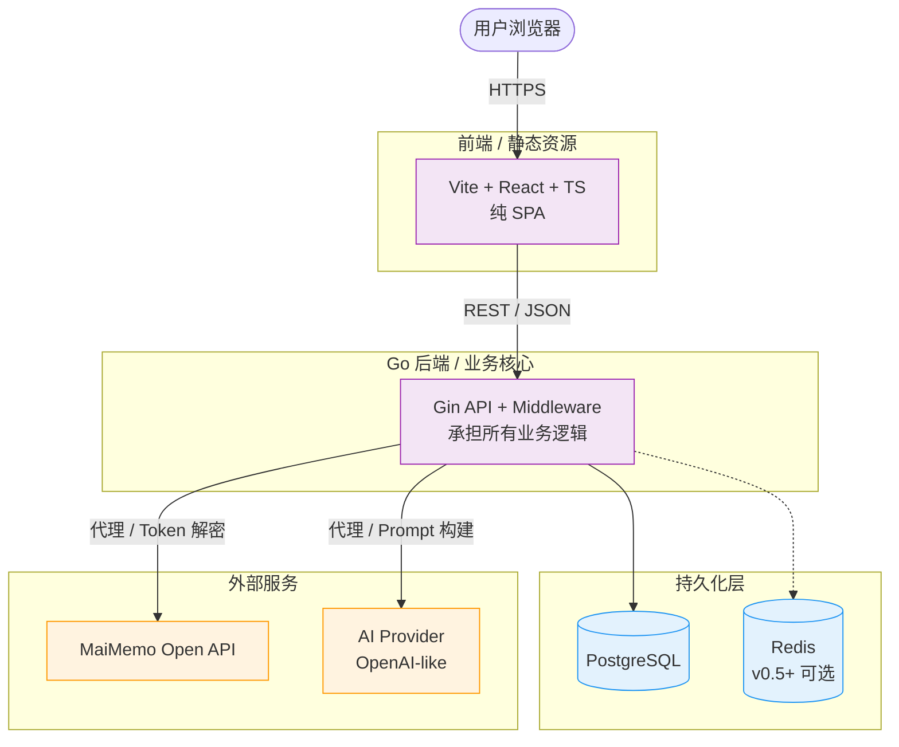
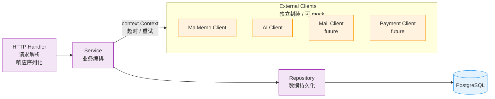

# Architecture

[Previous: product](product.md) · [Docs](../README.md) · [Next: data-model](data-model.md)

---

## 技术栈

### 推荐技术栈

前端（纯 SPA）：

```text
Vite
React
TypeScript
Tailwind CSS
shadcn/ui
React Router
TanStack Query
```

前端不承担任何服务端逻辑，所有数据接口由 Go 后端提供。前端只做页面渲染和与后端的 REST 通信。

不使用 Next.js 的原因：本项目不需要 SSR、SEO 或 ISR，使用 Vite 构建可以更快、配置更简单，部署也更轻量（静态资源 + Go API 双服务即可）。

后端：

```text
Go
Gin
GORM
PostgreSQL
Redis, v0.5 起引入（限流 / 异步任务辅助 / 后续缓存）
```

AI：

```text
OpenAI API
或兼容 OpenAI 协议的大模型服务
```

部署：

```text
Docker Compose
Vercel 或 Netlify 部署前端
Railway / Render / Fly.io / 云服务器部署 Go 后端
PostgreSQL 托管数据库
```

### 为什么后端使用 Go

本项目后端需要处理：

- 第三方 API 调用
- JSON 解析
- 数据库读写
- 用户认证
- Token 加密
- 后台同步任务
- 限流
- 超时控制
- 日志脱敏
- AI API 调用

这些场景和 Go 的并发、超时控制、接口分层、部署模型比较匹配。

## 系统架构

### 总体架构



前端是纯静态资源包，不持有 Token、不直接调用墨墨/AI。所有第三方调用都经过 Go 后端代理，便于做 Token 加密、限流和日志脱敏。

### 后端分层



每一层只依赖下一层，且 Service 不直接调用 `net/http`，外部 IO 全部通过 Client 接口注入，方便 mock 测试。

## 后端目录结构

推荐结构：

```text
backend/
  cmd/
    server/
      main.go
  internal/
    config/
      config.go
    database/
      db.go
      migrations.go
    auth/
      handler.go
      service.go
      repository.go
      jwt.go
      password.go
    user/
      model.go
      repository.go
    maimemo/
      client.go
      types.go
      service.go
      handler.go
    vocabulary/
      model.go
      handler.go
      service.go
      repository.go
      scoring.go
    article/
      model.go
      handler.go
      service.go
      repository.go
      coverage.go
    ai/
      client.go
      prompt.go
      service.go
      types.go
    sync/
      job.go
      service.go
      scheduler.go
    crypto/
      aes_gcm.go
    middleware/
      auth.go
      cors.go
      ratelimit.go
      logger.go
      recover.go
    export/
      markdown.go
      csv.go
  migrations/
  tests/
  Dockerfile
  go.mod
  go.sum
```

---

[Previous: product](product.md) · [Docs](../README.md) · [Next: data-model](data-model.md)
